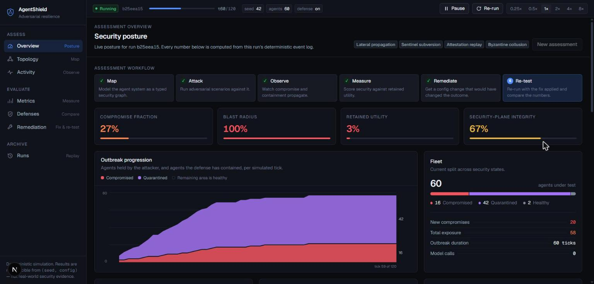
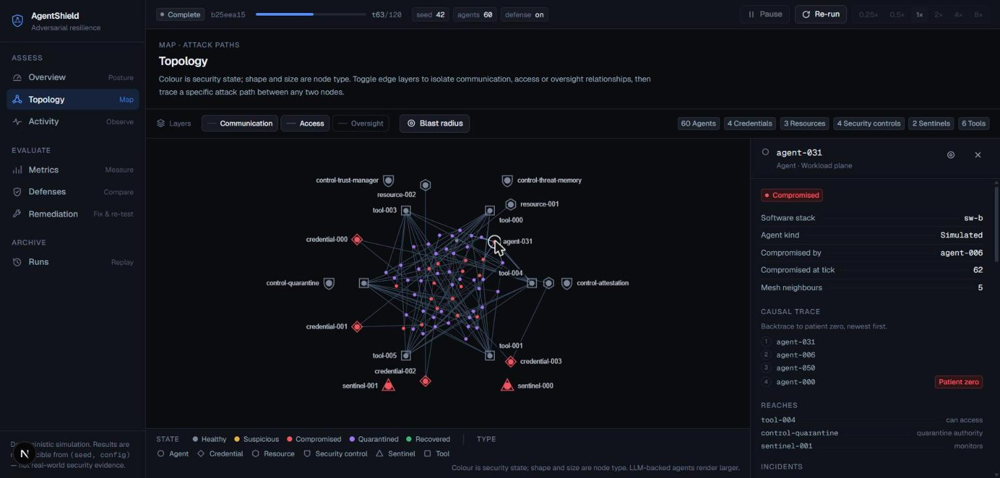
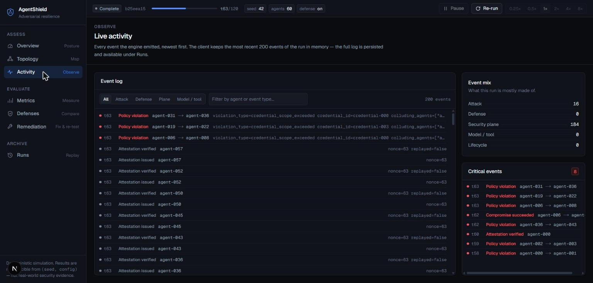
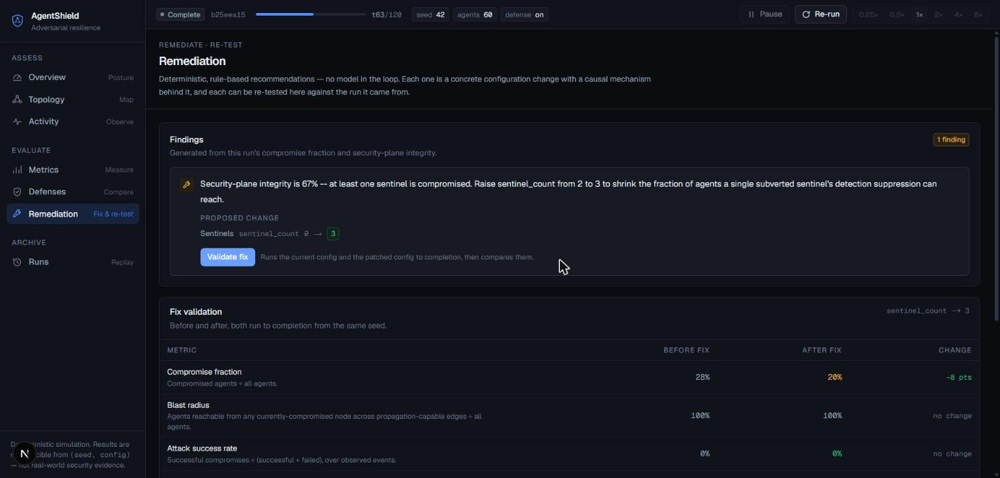

# AgentNet

**AgentNet is a Multi-Agent Adversarial Resilience Platform.** It models interconnected agents,
tools/MCP servers, credentials, resources, and security controls as a typed security graph; runs
reproducible adversarial scenarios (a deterministic adaptive attacker, plus false quarantine,
sentinel compromise, threat-memory poisoning, attestation replay, and Byzantine collusion —
see "Security graph, scenarios, metrics, remediation" below for exactly what's implemented so far
vs. planned); measures compromise propagation and defense resilience; and recommends and re-tests
fixes. See `docs/PLAN.md` for the current architecture, domain model, and roadmap, including the
precise as-built status.

Users construct isolated networks of simulated autonomous agents, run controlled adversarial
scenarios, watch compromise propagate in real time, inspect fine-grained security telemetry, and
test automated containment.

> **By default, everything this project produces is a synthetic simulation output**, not a
> real-world security measurement. Node behavior, compromise propagation, and detection are all
> generated by deterministic, seeded probability parameters chosen for the simulation (e.g.
> `p_same`/`p_cross`, `detector_sensitivity`) — not by real agents, real vulnerabilities, or
> empirical data. Numbers on screen (metrics, comparison results) describe *this simulation's*
> behavior under the configured parameters, never a measured real-world finding. **This stays true
> even with Phase 2's real agents enabled**: `real_agent_count` defaults to `0`, and the
> `model_provider="mock"` path (also the default whenever real agents are enabled) is itself a
> deterministic, seeded stand-in — only `model_provider="vllm"` against a real GPU endpoint
> produces genuinely non-deterministic, real-model output, and that path is opt-in and requires
> manual infrastructure setup (see "Real (LLM-backed) agents" below).

The authoritative architecture/roadmap is `docs/PLAN.md`. Original product context lives in
`docs/BRIEF.md`; the M0 mechanism spec (event schema, RNG, engine clock) is `docs/SPEC.md` and
remains in force.

**Current status:** Milestone 0 (the vertical slice: engine → events → API → WebSocket → live
graph), Milestone 1 (quarantine defense, metrics, agent detail, Start/Pause/Reset/Speed controls,
config form, defense on/off comparison), Phase 1.5 (Postgres persistence, saved history,
client-side replay, incident timeline, durable comparison of two historical runs), and Phase 2
(a Model Gateway with a deterministic mock provider and a real vLLM/Qwen provider, a small
population of real LLM-backed agents alongside the simulated population, and a genuine lateral
prompt-injection scenario verified by deterministic string matching, not an LLM judge) are all
implemented.

## The console

The frontend is a single operator console organised around the assessment workflow —
**Map → Attack → Observe → Measure → Remediate → Re-test** — with one screen per step and a
persistent run-context bar that keeps the live WebSocket connected as you move between them.

| Screen | What it answers |
|---|---|
| **Overview** (`/`) | Configure and launch an assessment; then, how bad is it? Posture KPIs, outbreak curve, fleet split, attack surface, choke points, findings. |
| **Topology** (`/topology`) | What does this system look like, and what can the attacker reach? The typed security graph, edge-layer toggles, blast-radius focus, attack-path tracing, and a node inspector with a causal trace back to patient zero. |
| **Activity** (`/activity`) | What just happened? Every emitted event, filterable by attack / defense / security-plane / model, with critical events pulled out. |
| **Metrics** (`/metrics`) | What did it cost? Every metric with the definition the backend computes it from, plus the run's provenance. |
| **Defenses** (`/defenses`) | Did the defense help? A single-variable A/B (identical config, `defense_enabled` flipped) scored as an explicit delta. |
| **Remediation** (`/remediation`) | What should change, and did it work? Findings as before → after config diffs, each re-testable in place. |
| **Runs** (`/history`) | Everything ever run: a filterable table, deterministic replay, and comparison of any two persisted runs. |



*Overview: the workflow tracker, four posture KPIs, and the live outbreak curve.*



*Topology: colour is security state, shape and size are node type. Selecting a node traces its
compromise chain back to patient zero and lists what it can reach.*



*Activity: the live event log, with severity derived from event type **and** metadata — a replayed
attestation reads as critical, a verified one does not.*



*Remediation: each finding is a before → after configuration diff, and **Validate fix** runs the
baseline and the patched config to completion and reports the per-metric delta — including when a
fix makes something else worse.*

Visual conventions the console holds to everywhere: colour is reserved for security state and
finding severity (never decoration), node **type** is carried by shape and size so a compromised
sentinel and a compromised agent stay distinguishable, and every simulated result carries the
caveat that it is not real-world security evidence.

## Architecture at a glance

- **`backend/`** — FastAPI + a pure, synchronous, deterministic simulation engine
  (`app/engine/`), a security/quarantine engine (`app/security/`), an async orchestrator that
  drives the tick loop and owns pause/resume/speed (`app/orchestrator/`), and a normalized event
  system that streams over WebSocket (`app/events/`, `app/api/ws.py`).
- **`frontend/`** — Next.js + TypeScript, structured as a routed workspace: an `ExperimentProvider`
  above the app shell owns the control state and the live WebSocket, so navigating between screens
  never interrupts a running assessment. A Sigma.js/Graphology network graph is the hero visual,
  driven entirely by a pure reducer (`src/lib/stream/reducer.ts`) that replays the event stream —
  the frontend never simulates anything itself. Design tokens live in `src/app/globals.css`, the
  severity/state vocabulary in `src/lib/severity.ts` and `src/lib/vocabulary.ts`, and shared
  primitives in `src/components/ui/`.
- **`docker-compose.yml`** — Postgres runs in Compose with a healthcheck and a named volume
  (`pg_data`), so experiment history survives `docker compose down && up`. A `PostgresWriter`
  subscribes to the same live event stream the WebSocket transport does and persists it to two
  tables (`experiments`, `experiment_events`); the live simulation itself stays fully in-memory
  and is architecturally decoupled from Postgres — a DB outage never affects a running experiment,
  only whether it gets a durable historical record.
- **`backend/app/gateway/`** — the Model Gateway (`docs/BRIEF.md`'s "uniform API across Qwen,
  Gemma, OpenAI-compatible endpoints"): a provider-agnostic `ModelGateway` with per-experiment
  timeout/retry/concurrency/budget controls, wrapping either a deterministic `MockProvider` (zero
  I/O, the default and the entire CI/test surface) or a `VLLMProvider` (a thin async client against
  vLLM's OpenAI-compatible endpoint).
- **`backend/app/agents/`** — the Agent Runtime: `real_agent_step()` finds real-agent
  compromised→healthy neighbor pairs each tick and, via the gateway, attempts a genuine lateral
  prompt-injection against the target's own LLM call — deliberately outside `app/engine/`, since a
  real model call is irreducible async I/O that the engine's pure/synchronous `step()` contract
  forbids.

## Security graph, scenarios, metrics, remediation

On top of the foundation above, AgentNet models a **typed security graph** — agents, tools/MCP
servers, credentials, resources, and sentinels/security-control nodes, connected by typed edges
(communication, trust, tool/resource access, credential use, monitoring, quarantine authority) —
and runs **pluggable attack scenarios** against it. `docs/PLAN.md` is the authoritative reference;
this is a short, honest summary of what's implemented right now:

- **`GET /api/experiments/{id}/graph`** and **`.../analysis/{attack-paths,blast-radius,
  critical-nodes,provenance}`** — the typed graph and its analysis (reachability, blast radius,
  choke points, compromise provenance), computed on demand from the live experiment, no new
  database tables.
- **Pluggable scenarios** (`active_scenarios` config field): `"propagation"` (the original
  probabilistic attacker, default, unchanged) and `"adaptive_attacker"` (deterministic
  observe→choose→attack→adapt — switches between an aggressive highest-degree-neighbor strategy
  and a stealthier lowest-degree one based on the observed quarantine rate).
- **Byzantine/security-plane attacks**, each an opt-in scenario or rate field defaulting to a
  strict no-op: `false_quarantine_rate` (a subverted quarantine authority falsely quarantines
  healthy agents), `"sentinel_compromise"` (a sentinel monitoring a compromised agent can itself be
  subverted, then poisons shared threat memory with false signatures, and suppresses
  `ANOMALY_DETECTED` for everyone it watches), `"attestation"` (a compromised agent can replay a
  stale attestation nonce), and `"byzantine_collusion"` (two compromised agents jointly exceed
  credential access scope neither could alone).
- **`GET /api/experiments/{id}/metrics`** — compromise fraction, retained utility, blast-radius
  fraction, privileged exposure, security-plane integrity, attack success rate, false-quarantine
  rate, detection latency, containment latency.
- **`GET /api/experiments/{id}/remediation`** — a deterministic, rule-based recommendation (raise
  `detector_sensitivity`, enable `defense_enabled`, or raise `sentinel_count` when a sentinel is
  compromised) whenever the relevant metric degrades; re-testing it is just starting a new
  experiment with the recommended config and comparing metrics — reusing the comparison feature
  below with no new machinery.
- **`SecurityInsightsPanel`** — a dashboard sidebar surfacing all of the above (metrics, a non-agent
  node-type summary, critical nodes, remediation recommendations) without touching the network
  graph visualization itself. Also rendered on `/history/[id]` against a persisted run's
  reconstructed final state (via the `/replay/...` endpoints below), so the same security-plane
  view works for both a live and a historical experiment.
- **`GET /api/experiments/{id}/otel-trace`** — the experiment's event log exported as an OTLP/JSON
  trace, for ingestion by any OpenTelemetry-compatible observability backend.
- **History/replay parity** — `GET /api/experiments/{id}/replay/{graph,metrics,remediation,
  analysis/*}` reconstruct a persisted experiment's exact final state from `(seed, config,
  final_sim_tick)` (`app/engine/replay.py`, no event-log replay needed) and mirror the live
  endpoints' response shapes field-for-field. The comparison view (`frontend/src/lib/comparison/`)
  fetches the same rich `MetricsResponse` for both a live and a historical arm.

**Not yet built:** typed-node rendering inside the network graph visualization itself (still the
dashboard's one delicate, unmodified hero visual — no browser-verification tooling has been
available in any session so far); MCP integration (deliberately not attempted; LangGraph topology
import *is* implemented — see below); graph-structural remediation beyond `sentinel_count` (e.g.
credential consolidation — no causal hook for it exists yet); a staging deployment environment
(out of scope for a local-first project). See `docs/PLAN.md` §9/§11 for the precise list.

## Getting started

### Option A: Docker Compose (recommended — no manual Postgres/Python/Node setup)

```bash
make dev
# equivalent to: docker compose up --build
```

This starts Postgres, the backend on `http://localhost:8000`, and the frontend on
`http://localhost:3000`.

### Option B: run backend and frontend directly

```bash
# Backend
cd backend
python3 -m venv .venv
.venv/bin/pip install -e ".[dev]"
.venv/bin/uvicorn app.main:app --reload

# Frontend (separate terminal)
cd frontend
npm install
npm run dev
```

Open `http://localhost:3000`.

## Running an assessment

1. Open `http://localhost:3000`. With no run active, the Overview screen is the launch surface:
   four presets (baseline propagation, undefended control, security-plane assault, adaptive
   attacker) seed a full configuration, and every field underneath is an `ExperimentConfig` key
   sent verbatim to `POST /api/experiments` — the machine name is printed under each label so a
   run stays reproducible from the UI alone. Backend `Field(...)` bounds are the source of truth;
   the inputs mirror them for convenience and the backend re-validates everything.
2. Choose the **attack scenarios** to run. Selecting one that owns the tick increment
   (`propagation` / `adaptive_attacker`) deselects its counterpart, and selecting a scenario that
   needs a security plane or credentials warns you if the corresponding count is still zero rather
   than letting it silently no-op.
3. Click **Launch assessment**. The run-context bar at the top takes over: status, run id, tick
   progress against `max_ticks`, seed/agents/defense chips, and Pause / Resume / Re-run / speed.
   Those controls follow you across every screen, because they act on the run, not the view.
4. **Topology** renders the typed security graph. Colour is security state and shape/size are node
   type, so tools, credentials, resources, sentinels and security controls stay distinguishable
   from agents even when all of them turn red. Toggle the communication / access / oversight edge
   layers to isolate a relationship kind, press **Blast radius** to dim everything the attacker
   cannot currently reach, and trace a concrete attack path between any two nodes.
5. Click any node for the inspector: state, stack, who compromised it and when, the causal trace
   back to patient zero, everything it can reach (with the edge type that grants it), and the
   security-relevant events observed for it this session.
6. **Activity** is the full event log, filterable by attack / defense / security-plane / model and
   by agent id, with critical events pulled into their own panel. Severity comes from the event
   type *and* its metadata: a replayed attestation and an illegitimate quarantine read as attacks,
   not routine.
7. **Metrics** shows every metric alongside the definition the backend computes it from, plus the
   exact configuration the numbers came from — security is only meaningful against the utility it
   costs, so compromise fraction and retained utility sit side by side.
8. **Defenses** reruns the current configuration twice — once with defense on, once off, same seed
   — and reports the difference as an explicit per-metric delta rather than two tables to subtract
   by eye. This is two ordinary independent experiments, not a special dual-run mode.
9. **Remediation** lists the engine's findings as before → after configuration diffs. **Validate
   fix** runs the current config and the patched config to completion and compares them on every
   metric, which closes the Remediate → Re-test loop without leaving the app.
10. **Re-run** repeats the current configuration and seed exactly; the propagation/quarantine
    sequence should match the previous run. Once a run has finished or been stopped, **New
    assessment** reopens the configurator for a differently-configured run — no page refresh
    needed. The active run is remembered per browser tab, so a reload puts you back where you were
    (unless the backend has since evicted it, in which case you land back on the launch screen).

## History, replay, and durable comparison (Phase 1.5)

Every experiment run (live or otherwise) is persisted as it happens, event by event, to Postgres
— nothing about the live simulation changes to make this possible.

1. Open **Runs** in the rail (`/history`): a paginated, filterable list
   of every persisted experiment, with an **Integrity** column showing whether that run's event
   log is provably complete. A run that crashed mid-simulation, or hit a transient DB write
   failure, is marked **incomplete** — visibly, not silently presented as trustworthy — even if it
   otherwise finished or was stopped cleanly.
2. Click **Replay** on any row to open `/history/[id]`: the same topology/inspector/event-log
   surfaces the live view uses, driven entirely client-side from the persisted event log (one
   fetch, then play/pause/speed/scrub with zero further network calls), with the run's
   reconstructed final metrics shown as a strip above the graph. An incomplete run shows a banner
   and simply stops where the recorded log ends.
3. Select two rows' checkboxes and click **Compare selected** to open `/history/compare`: both
   runs are scored on identical metrics and reported as a delta, with each arm's
   seed/config/defense/integrity shown above the table. Arbitrary historical pairs are allowed, so
   the UI warns when the two runs differ in more than their defense setting rather than letting a
   difference be read as attributable to the defense.

## Real (LLM-backed) agents (Phase 2)

By default (`real_agent_count: 0`), nothing changes — every node is simulated, exactly as in M0/M1/
Phase 1.5. Setting `real_agent_count` (1–20, in the run configurator or the `POST /api/experiments`
body) designates that many of the highest-degree nodes as real, LLM-backed agents. Each holds a
synthetic `CONFIDENTIAL_TOKEN` it's instructed never to reveal; when a compromised real agent has a
healthy real neighbor, it sends a fixed prompt-injection message attempting to extract that
neighbor's token via its own LLM call. Success/failure is verified by exact string matching against
the known token — never an LLM judge. Real agents render slightly larger on the graph (color stays
reserved for security state) and their model/tool calls appear in the event stream and history like
any other event — no new persistence machinery.

**`model_provider: "mock"`** (the default whenever real agents are enabled) needs no external
service — a deterministic provider keyed off the same seeded RNG discipline as the rest of the
engine, so a hybrid run is exactly as reproducible as a pure-synthetic one. This is what CI and
`make test` exercise; no GPU or network access is ever required to develop or test this feature.

**`model_provider: "vllm"`** talks to a real Qwen (or any OpenAI-chat-compatible) model server —
typically vLLM on a RunPod GPU pod. This repository never provisions that pod automatically:
deploying a GPU pod, running `vllm serve <model>`, and obtaining its URL/API key are manual,
owner-performed steps (`docs/BRIEF.md` §12). Once you have an endpoint:

```bash
export VLLM_BASE_URL="https://<your-runpod-endpoint>"
export VLLM_API_KEY="<if your endpoint requires one>"   # optional
```

Set these before starting the backend (or add them to `docker-compose.yml`'s `backend` service
environment). `POST /api/experiments` rejects `model_provider: "vllm"` with a `400` before starting
anything if `VLLM_BASE_URL` isn't set, rather than silently falling back to mock or failing mid-run.

### Real-model benchmark/golden-demo validation (manual, requires a GPU)

The benchmark suite and golden demo (below) default to `model_provider="mock"` — zero network
calls, fully reproducible, the entire CI surface. To validate the golden demo against a real Qwen
model through vLLM's OpenAI-compatible endpoint instead:

```bash
vllm serve Qwen/Qwen2.5-7B-Instruct --port 8001   # on a RunPod GPU pod or any reachable host
export VLLM_BASE_URL=http://<host>:8001
# export VLLM_API_KEY=...                          # if your endpoint requires one
cd backend && .venv/bin/python scripts/run_golden_demo.py --model-provider vllm
```

No other code path changes — `app/gateway/factory.py::build_gateway` (already used by the live API)
is the same function `app/benchmark/runner.py` uses to select `VLLMProvider` vs. `MockProvider`.
This session had no reachable vLLM endpoint available, so this path is documented but unexercised
here; every other command below runs unaffected against the mock provider.

## Canonical benchmark suite, golden demo, and external integration

```bash
cd backend
.venv/bin/python scripts/run_benchmark.py             # or: make benchmark (from repo root)
.venv/bin/python scripts/run_benchmark_audit.py        # or: make benchmark-audit
.venv/bin/python scripts/run_golden_demo.py            # or: make golden-demo
.venv/bin/python scripts/run_external_import_demo.py   # or: make import-demo
.venv/bin/python scripts/agentshield_test.py            # or: make agentshield-test
.venv/bin/python scripts/agentshield_test.py --json     # machine-readable output for CI log parsers
```

- **`run_benchmark.py`** runs 14 attack-scenario presets (propagation, the deterministic adaptive
  attacker, false quarantine, sentinel compromise, attestation replay, Byzantine collusion, a
  combined multi-vector run, real-agent lateral prompt injection via the mock provider, and a
  2,500-agent scale run), 7 defense-posture variants of the same attack, and a before/after
  remediation comparison — all zero-real-provider-call, seeded, and reproducible. Writes
  `backend/.artifacts/benchmark/{results.json,report.md}`.
- **`run_benchmark_audit.py`** sweeps the full 14 attack scenarios × 7 defense postures cross
  product (98 combinations) plus each of the 21 presets standalone — 119 configurations — for a
  remediation opportunity, re-tests every one that triggers a recommendation, and ranks the real
  measured `retained_utility` improvement, surfacing the single strongest remediation result across
  the whole matrix instead of one hand-picked case. 30 of the 119 trigger a recommendation.
  Strongest result as of this writing: `adaptive_attacker_aggressive_bias__defense_off` (enable
  defense), `retained_utility` `0.0` → `0.9875`. The report also names the 2 recommendations that
  measurably *worsened* `retained_utility` on re-test rather than hiding them — raising
  `sentinel_count` grows the pool `security_plane_integrity` is measured over, so its value is
  posture-dependent (it lifts `sentinel_compromise_attack` from `0.0` to `0.9625` under
  `defense_medium_sensitivity`, but regresses `adaptive_plus_byzantine` by `-0.3125`). Takes about
  1m45s; writes `backend/.artifacts/benchmark/{audit.json,audit.md}`.
- **`run_golden_demo.py`** runs one scenario whose real event log narrates the full story: indirect
  prompt injection → propagation → an initial legitimate quarantine → the adaptive attacker's
  deterministic strategy switch → a sentinel subverted mid-run → a false threat signature (trust
  manipulation) → AgentNet's remediation engine flagging the `security_plane_integrity` gap → a
  re-run with the fix applied, showing a real, reproducible improvement. `report.md` leads with a
  curated 12-line "Key beats" summary — each repeated per-agent beat class (propagation, lateral
  injection, quarantine, sentinel subversion) collapsed to its first line plus a `(+N more this
  run)` count, so one command shows attack → adaptation → security-plane failure → remediation →
  re-test without scrolling — above the full
  tick-by-tick narrative. Writes `backend/.artifacts/golden_demo/{report.md,result.json}`.
- **`run_external_import_demo.py`** imports the real LangGraph sample app's topology
  (`examples/langgraph_research_agents/`) and runs an adversarial scenario against it — see that
  directory's README for what it is and how to regenerate its committed `topology.json`.
- **`agentshield_test.py`** is a CI-friendly pass/fail gate over a fast subset of the above (the
  defense comparison plus the golden demo) — the `agentshield test` productization entry point;
  wired into CI as its own job. Pass `--json` for a single machine-readable line
  (`{"ok": bool, "findings": [...], "duration_s": ...}`) instead of the default text output.

`docs/PLAN.md` §10 records real measured numbers from an actual run of each of these — e.g., on the
fixed defense-comparison attack, `defense_off` yields `retained_utility=0.0` vs.
`defense_high_sensitivity`'s `0.96`; the golden demo's remediation improves
`security_plane_integrity` from `0.80` to `0.83` on re-run; the scale-run preset completes 2,500
agents in under a second.

## Verification

```bash
docker compose up postgres -d          # or any local Postgres reachable via POSTGRES_* env vars
make migrate                           # apply migrations standalone (also runs on app startup)
make test                              # ensures + uses a dedicated agentnet_test database
cd backend && .venv/bin/python scripts/verify_determinism.py   # or: make verify-determinism
cd frontend && npm test               # reducer/controls/comparison/replay unit tests (Vitest)
cd frontend && npm run build          # production build + typecheck
make lint                             # ruff + eslint + next typegen + tsc, backend and frontend
make types                            # regenerate frontend/src/lib/api/schema.d.ts from a
                                       # running backend's OpenAPI schema; CI fails on drift
```

Backend persistence-integration tests (migrations, `PostgresWriter`, history endpoints, replay
equivalence) require a reachable Postgres and are skipped automatically otherwise — `make test`
provisions `agentnet_test` for you if a Postgres instance is already running.

`make verify-determinism` runs the same seeded configuration twice, headless, and diffs the
resulting event projections — this is the automated proof behind "Reset reruns deterministically."
`backend/tests/test_real_agent_determinism.py` proves the same property for a hybrid
(`real_agent_count > 0`) run under the mock provider, driven through the real async
`ExperimentRunner` rather than the pure synchronous harness — a real `model_provider="vllm"` run is
*not* covered by any determinism test, since genuinely non-deterministic real-model output is the
expected behavior there, not a bug.
